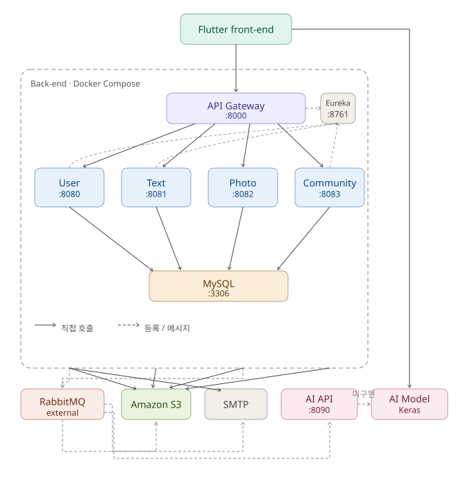
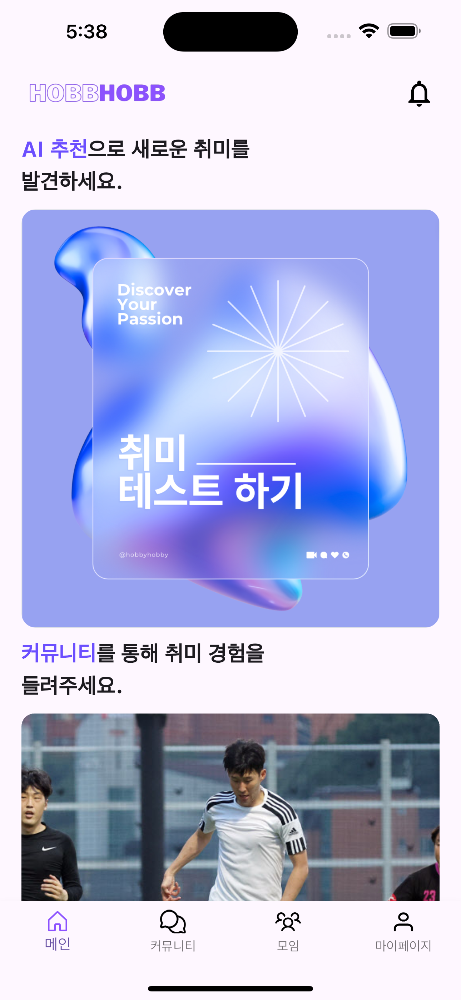
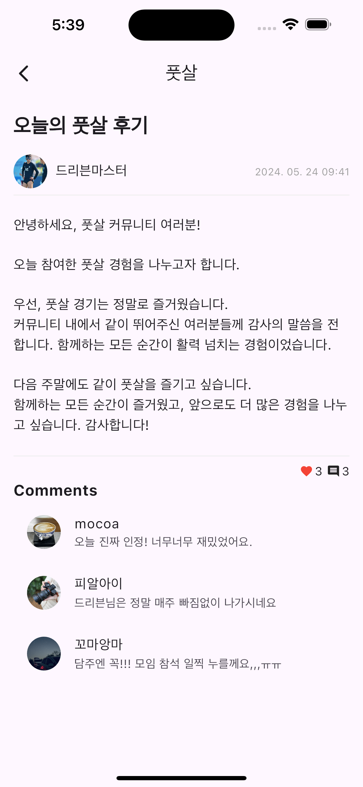
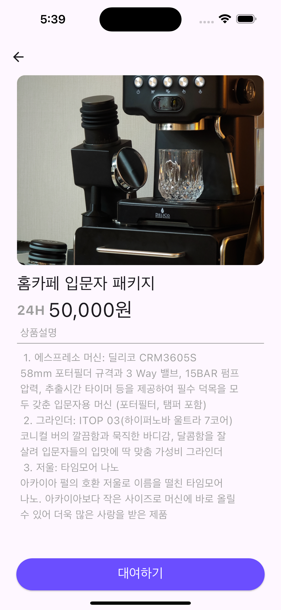
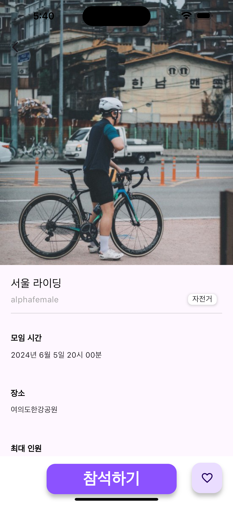

# HappyHobby Back-end

취미 입문자를 위한 **community, gathering, equipment review/rental** 기능을 제공하는 Spring Boot 기반 microservices backend입니다.  
API Gateway와 Eureka로 service를 연결하고, RabbitMQ event로 사용자·콘텐츠 정보를 domain 간 동기화합니다.

  
  
  
  
  
  

  <a href="#overview">Overview</a> ·
  <a href="#architecture">Architecture</a> ·
  <a href="#service-domains">Service Domains</a> ·
  <a href="#core-features">Core Features</a> ·
  <a href="#service-preview">Preview</a> ·
  <a href="#tech-stack">Tech Stack</a> ·
  <a href="./DEV.md">DEV Guide</a> ·
  <a href="#backend-team">Backend Team</a>

## Overview

HappyHobby는 다양한 취미를 경험하고 싶은 2030 세대가 취미를 더 쉽게 시작하고, 장비 정보와 커뮤니티 경험을 한 곳에서 얻을 수 있도록 기획한 취미 플랫폼입니다.

취미 선택의 어려움, 입문 장비 정보의 파편화, 매니아 중심 커뮤니티의 높은 진입장벽, 장비 구매 부담을 해결하기 위해 **취미 추천, H-Log/H-Board, 모임, 장비 리뷰, 스타터팩 대여**를 하나의 서비스 경험으로 구성했습니다.

Backend는 사용자·콘텐츠·커뮤니티 기능을 독립적인 Spring Boot service로 분리한 microservices architecture를 사용합니다.

## Architecture

  

Gateway는 외부 요청을 받아 Eureka에 등록된 `User`, `TextContent`, `PhotoContent`, `Community` service로 routing합니다. Domain service는 MySQL 기반 persistence를 사용하며, 필요한 cross-domain 변경 사항은 RabbitMQ event로 전달합니다.

Docker Compose에는 Gateway, Eureka, 네 개의 domain service와 MySQL이 포함됩니다. RabbitMQ는 현재 Compose 외부의 broker를 사용합니다.

## Service Domains

| Service | Responsibility |
| --- | --- |
| `hobbyhobby-gateway` | API routing, CORS, JWT access-token validation, Swagger aggregation |
| `hobbyhobby-eureka` | Gateway와 domain service의 service registry |
| `hobbyhobby-user` | 회원가입·로그인, OAuth, token, 이메일 인증, profile |
| `hobbyhobby-textcontent` | H-Board, text post, equipment review, comment, like |
| `hobbyhobby-photocontent` | H-Log, photo post, gathering, member, comment, like |
| `hobbyhobby-community` | community 탐색, 즐겨찾기, 추천 및 인기 content |
| `hobbyhobby-common` | 공통 response DTO와 error type |

## Core Features

### User & Authentication
회원가입, 로그인, OAuth, access/refresh token, 이메일 인증, 비밀번호 재설정과 profile 관리를 제공합니다.

### Community & Content
H-Log는 사진 중심의 취미 활동 공유를, H-Board는 후기와 정보를 중심으로 한 text community를 담당합니다.

### Gathering
취미별 모임 생성과 참여 정보를 관리해 online community 경험을 실제 취미 활동으로 확장합니다.

### Equipment Review & Rental
장비 평가와 사용자 review를 제공하고, 취미별 starter pack 대여를 통해 입문 단계의 장비 구매 부담을 낮추도록 구성했습니다.

### Event-driven Synchronization
User 변경 사항은 TextContent, PhotoContent, Community로 전달되며, PhotoContent의 photo/gathering/like 변경은 Community 조회 데이터에 반영됩니다.

## Service Preview

### Discover & Community

<table>
  <tr>
    <td align="center"><strong>Main</strong></td>
    <td align="center"><strong>H-Log</strong></td>
    <td align="center"><strong>H-Board</strong></td>
  </tr>
  <tr>
    <td></td>
    <td></td>
    <td></td>
  </tr>
</table>

### Equipment & Gathering

<table>
  <tr>
    <td align="center"><strong>Equipment Review</strong></td>
    <td align="center"><strong>Starter Pack Rental</strong></td>
    <td align="center"><strong>Gathering</strong></td>
  </tr>
  <tr>
    <td></td>
    <td></td>
    <td></td>
  </tr>
</table>

## Tech Stack

| Area | Technology |
| --- | --- |
| Backend | Java 17, Spring Boot 3.0.0 |
| Microservices | Spring Cloud Gateway, Netflix Eureka |
| Persistence | Spring Data JPA, MySQL |
| Messaging | Spring Cloud Stream, RabbitMQ |
| Security | JWT (JJWT) |
| Storage | Amazon S3 |
| API Documentation | springdoc-openapi |
| Build & Deployment | Gradle, Docker, Docker Compose, GitHub Actions |
| Quality | JUnit, JaCoCo |

## Development

Local setup, service ports, Gateway routes, RabbitMQ bindings, database configuration, Docker 환경 및 구현상 제약사항은 [DEV.md](./DEV.md)를 참고하세요.

## Related Repositories

| Repository | Description |
| --- | --- |
| [HappyHobyy/Back-end](https://github.com/HappyHobyy/Back-end) | Spring Boot microservices backend |
| [HappyHobyy/Front-end](https://github.com/HappyHobyy/Front-end) | Flutter client |
| [HappyHobyy/AI_model](https://github.com/HappyHobyy/AI_model) | Hobby recommendation model |

## Backend Team

<table>
  <tr>
    <td align="center" width="240">
       
      <a href="https://github.com/banseok1216"><strong>김반석</strong></a> 
      PhotoContent · Community · Infrastructure
    </td>
    <td align="center" width="240">
       
      <a href="https://github.com/Nutriatree"><strong>박지우</strong></a> 
      Persistence · Community Integration
    </td>
  </tr>
</table>

## License

**All Rights Reserved.**

Copyright © HappyHobby.  
이 repository의 source code는 별도의 명시적 허가 없이 사용, 수정, 복제 또는 재배포할 수 없습니다.
